# Screenshot Progress — Awanara

Dokumentasi visual perkembangan aplikasi per fase. Diperbarui setiap ada perubahan UI yang signifikan.

## Cara mengambil screenshot

```bash
pnpm build
pnpm start -p 3000          # terminal 1
node scripts/capture-screenshots.mjs   # terminal 2
```

Script menghasilkan `screenshots/<route>-<viewport>-<theme>.png` otomatis untuk 4 route × tema light/dark, dengan viewport home 360/768/1440px.

---

## Progress: Phase 1 — Design System & App Shell (2026-08-04)

### Home — Light & Dark

| Viewport | Light | Dark |
|---|---|---|
| Mobile 360px | 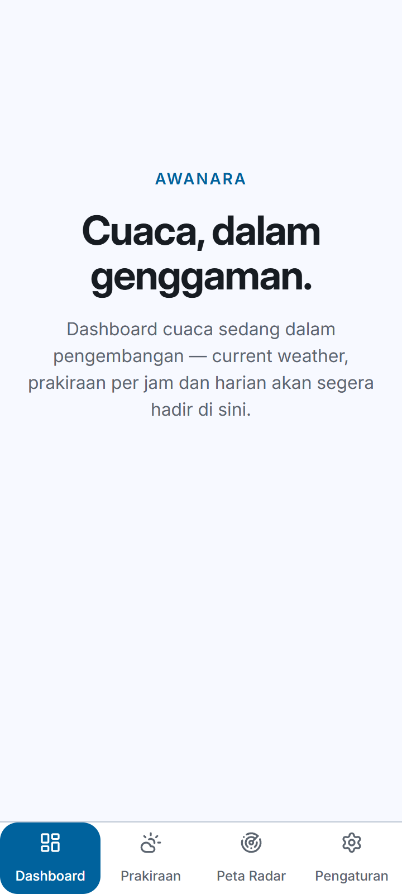 | 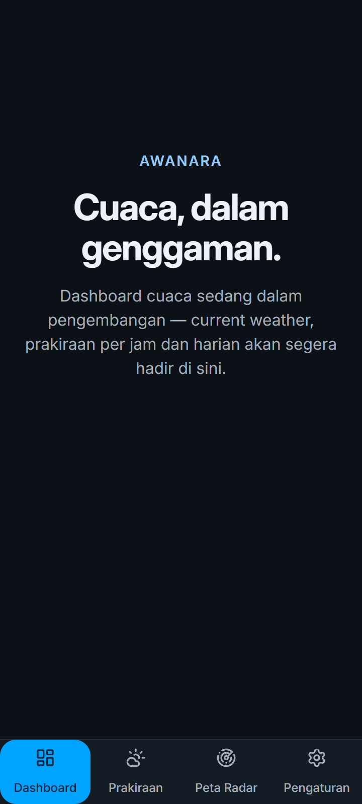 |
| Tablet 768px | 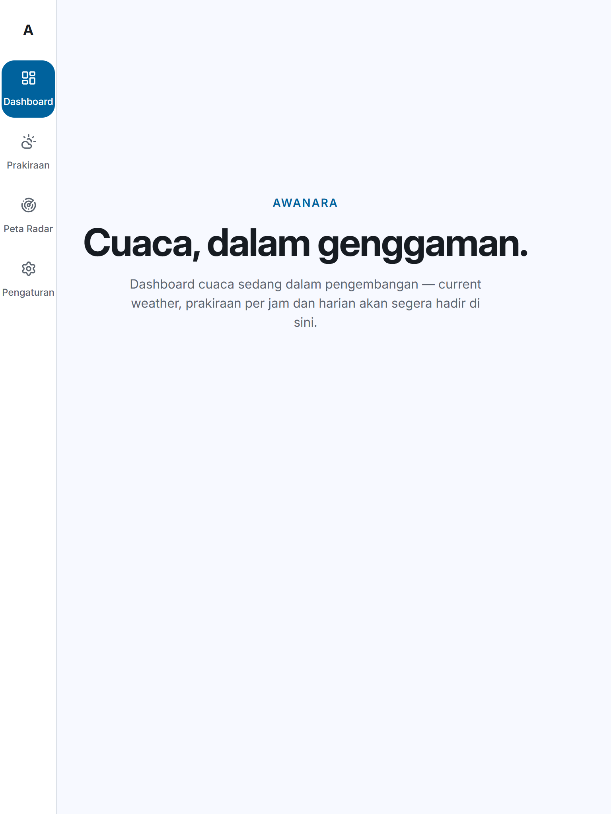 | 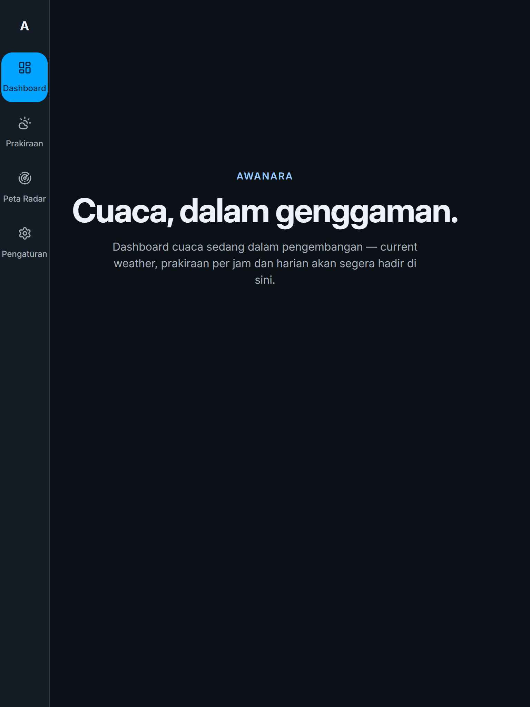 |
| Desktop 1440px | 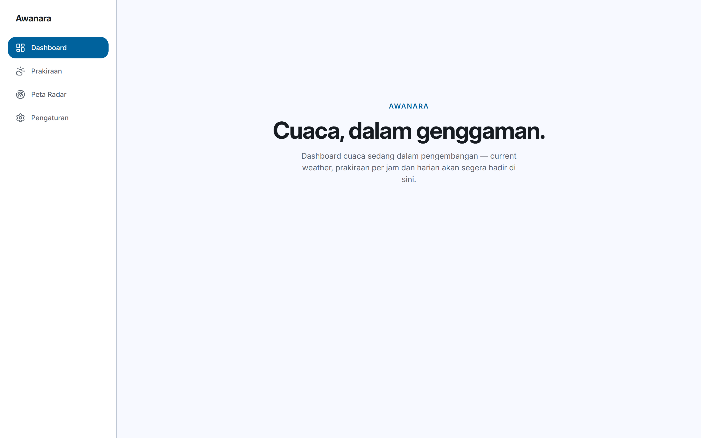 | 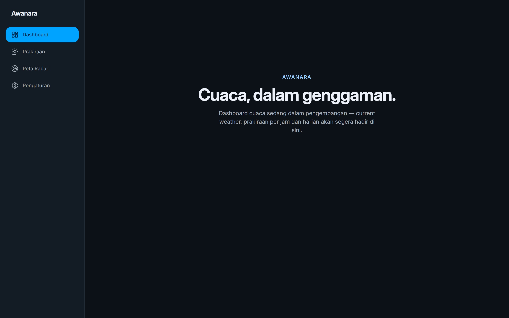 |

### Halaman lain — Desktop 1440px

| Halaman | Light | Dark |
|---|---|---|
| Prakiraan (`/forecast`) | 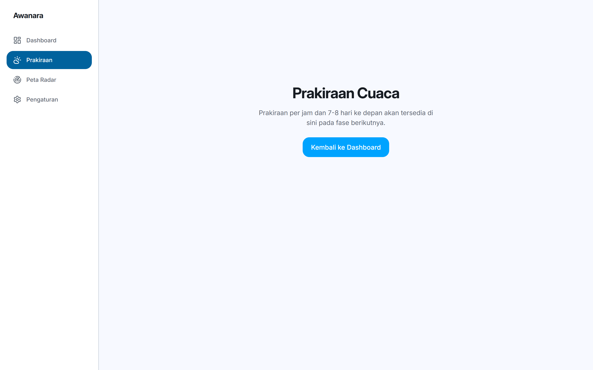 | 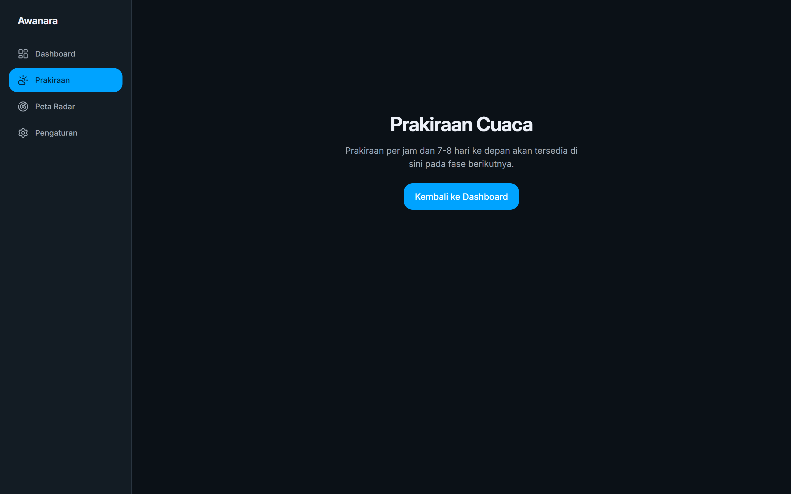 |
| Peta Radar (`/radar`) | 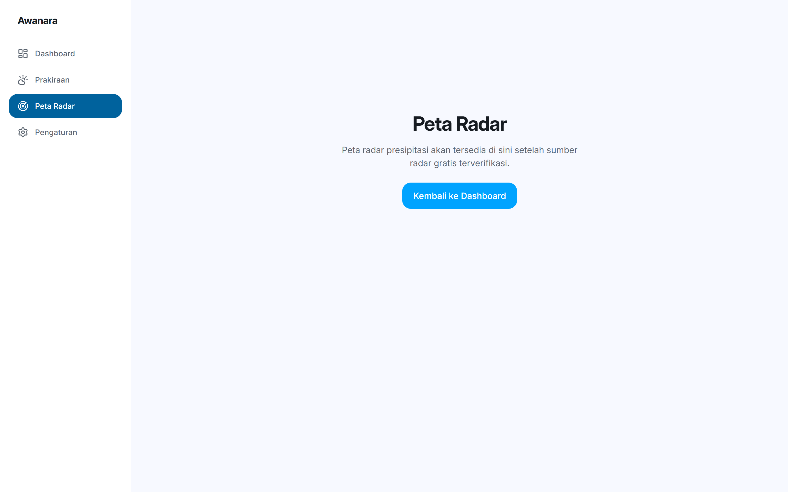 | 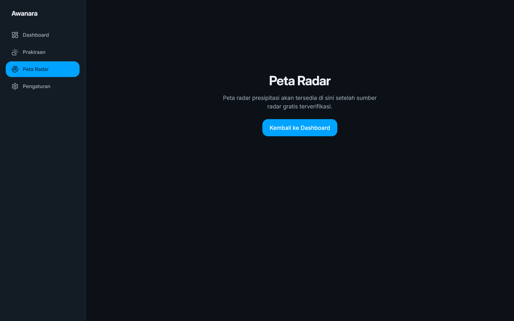 |
| Pengaturan (`/settings`) | 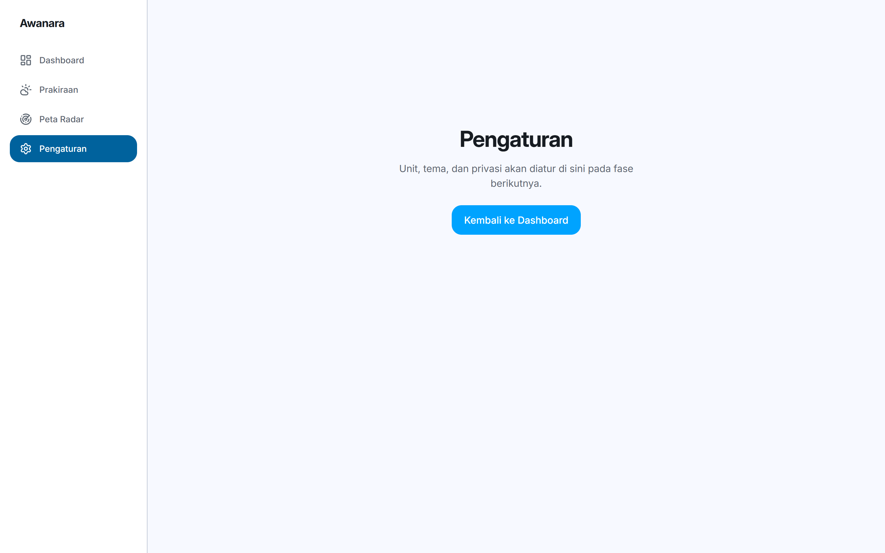 | 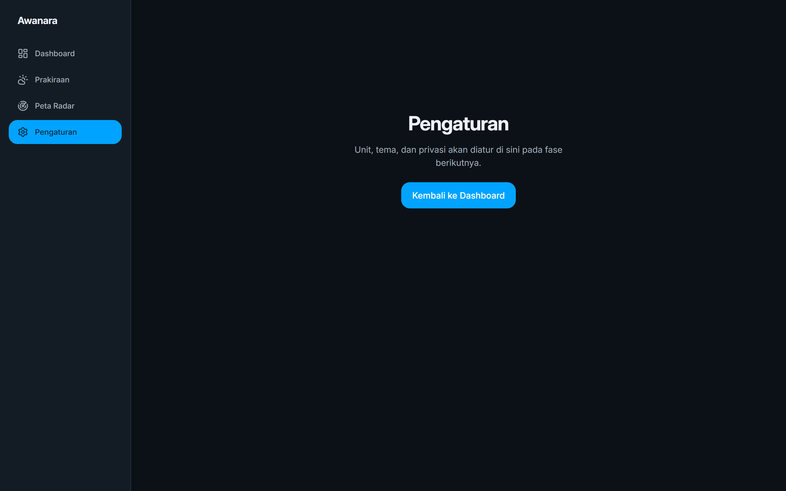 |

---

## Catatan per fase

### Phase 1 (2026-08-04) — Shell & Design System ✅
- Layout responsif: sidebar desktop (240px), rail tablet (72px), bottom navigation mobile.
- Tema light/dark/system (persist di localStorage, anti-FOUC).
- Design tokens WeatherWise-inspired dengan kontras WCAG 2.2 AA.
- Font Inter variable self-hosted.
- Placeholder `/forecast`, `/radar`, `/settings` (konten final di fase berikutnya).

### Phase 2+ — Belum dimulai
Dashboard cuaca, BFF API, forecast detail, dan radar menyusul.